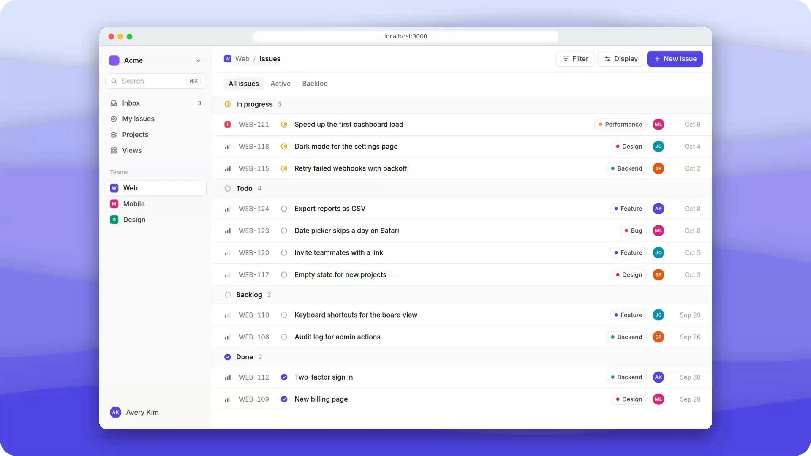

<div align="center">

<h1>
  <picture>
    <source media="(prefers-color-scheme: dark)" srcset="./assets/logo-wordmark-dark.svg" />
    
  </picture>
</h1>

**Ask Claude for a demo video.** Claude clicks through your web app and hands back a polished MP4 that zooms in on each click.

[Website](https://cursorcam.vercel.app) &nbsp;·&nbsp; [Changelog](./CHANGELOG.md) &nbsp;·&nbsp; [Contributing](./CONTRIBUTING.md)

<sub>CursorCam is in beta. If something breaks, please [open an issue](https://github.com/Avijit07x/cursorcam/issues).</sub>

<p>
  <a href="https://www.npmjs.com/package/cursorcam"></a>
  <a href="https://github.com/Avijit07x/cursorcam/stargazers"></a>
  <a href="https://github.com/Avijit07x/cursorcam/graphs/contributors"></a>
  <a href="https://github.com/Avijit07x/cursorcam/commits"></a>
  <a href="./LICENSE"></a>
</p>

</div>

<a href="./assets/demo.mp4"></a>

<p align="center"><sub>Made with CursorCam from 13 steps. <a href="./assets/demo.mp4">Watch the full-quality MP4</a> (1080p, 60 fps).</sub></p>

---

## Setup

**You need** [Claude Code](https://claude.com/claude-code), Node.js 22.13+ and Chrome, Edge, Chromium or Brave 120+. CursorCam uses the browser you already have and downloads nothing.

**1. Install the plugin** in Claude Code:

```
/plugin marketplace add Avijit07x/cursorcam
/plugin install cursorcam@cursorcam
/reload-plugins
```

**2. Ask for a video:**

```
/cursorcam http://localhost:3000 sign up and create a project
```

Or ask in your own words: "Make a demo of the checkout flow for LinkedIn."

**3. Get the video.** You get `video.mp4` (1080p, 60 fps) and a `poster.jpg` thumbnail in `cursorcam-output/`. Add that folder to `.gitignore`.

## How it works

Claude explores your app, writes the steps and records them in a hidden browser. Then it checks the video and fixes anything that looks wrong.

If it needs a login or a 2FA code, it asks you. What you type is used for that run only and never saved.

## Use the CLI

The plugin runs the `cursorcam` CLI. You can run it yourself too:

```bash
npx cursorcam@beta doctor
npx cursorcam@beta run steps.json
```

```json
{
  "url": "http://localhost:3000",
  "steps": [
    { "click": "role=button[name='Get started']" },
    { "type": "alex@example.com", "into": "label=Email" },
    { "press": "Enter" },
    { "waitFor": "text=Dashboard" }
  ]
}
```

## Docs

| Guide | Covers |
| --- | --- |
| [Getting started](./docs/getting-started.md) | Install the plugin and make your first video |
| [Better videos](./docs/better-videos.md) | How to ask Claude, with example requests and tips |
| [Steps file](./docs/steps.md) | Every action, target and option |
| [Look and size](./docs/style.md) | Presets for X, LinkedIn, YouTube and Discord, formats, backgrounds and zoom |
| [Logins and secrets](./docs/logins.md) | Passwords, 2FA codes and saved logins |
| [CLI](./docs/cli.md) | Every command, the run folder and exit codes |
| [Troubleshooting](./docs/troubleshooting.md) | Common errors and how to fix them |
| [Examples](./docs/examples/) | Steps and style files to copy and edit |

## Contributing

Bug reports and pull requests are welcome. See [CONTRIBUTING.md](./CONTRIBUTING.md). To report a security problem, see [SECURITY.md](./SECURITY.md).

## License

[Apache-2.0](./LICENSE)
